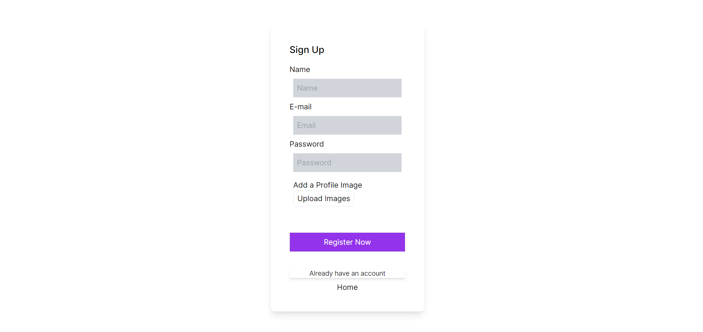

# Next.js TypeScript E-commerce Project

This is a study project focused on building an e-commerce platform using Next.js with TypeScript. The project integrates with a PostgreSQL database using Prisma ORM. It encompasses various functionalities essential to an e-commerce platform, including user authentication, product management (creation, deletion, and editing), and Stripe integration for handling purchases.

## Features

- **User Authentication:** Users can sign up, log in, and log out.
- **Product Management:** Admins can add new products with details such as name, image, description, and other attributes. They can also delete or edit existing products.
- **Stripe Integration:** Users can purchase products securely using the Stripe payment gateway.

## Technologies Used

- **Next.js:** A React framework for building server-side rendered and statically generated applications.
- **TypeScript:** A statically typed superset of JavaScript that enhances code quality and developer productivity.
- **PostgreSQL:** A powerful open-source relational database management system.
- **Prisma:** A modern ORM for TypeScript and Node.js that simplifies database access and management.
- **Stripe:** A popular payment gateway for securely processing online transactions.

## Getting Started

To get started with this project, follow these steps:

1. Clone the repository: `git clone <repository_url>`
2. Install dependencies: `npm install`
3. Set up PostgreSQL and configure the connection in the project.
4. Run database migrations using Prisma: `npx prisma migrate dev`
5. Set up Stripe and configure the API keys.
6. Start the development server: `npm run dev`

## Contributing

Contributions are welcome! If you'd like to contribute to this project, please follow these guidelines:

- Fork the repository.
- Create a new branch for your feature/fix: `git checkout -b feature-name`
- Make your changes and commit them: `git commit -am 'Add new feature'`
- Push to the branch: `git push origin feature-name`
- Submit a pull request.

## Study Content and Tools: 
[Tutorials](https://www.youtube.com/@perfect__code_)  
[Next.js Doc](https://nextjs.org/docs) 
[Prisma Doc](https://www.prisma.io/docs/orm/overview/introduction/what-is-prisma) 
[Download PostgreSql](https://www.postgresql.org/) 
[Cloudinary](https://cloudinary.com/) 
[Use Stripe](https://docs.stripe.com/development) 

## Take a look!

Dashboard:
 
 

User:
 
 

SignUp:
 
 

Signin:
 
 

Stripe:
 
 

My products:
 
 

See product:
 
 

Product Review:
 
 

Create Product:
 
 

 

Cart:
 

 

